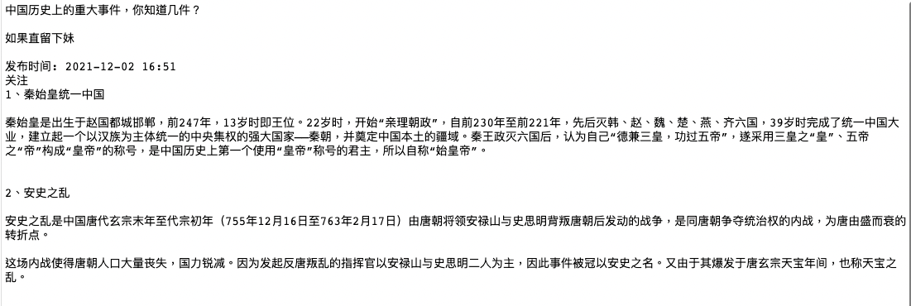
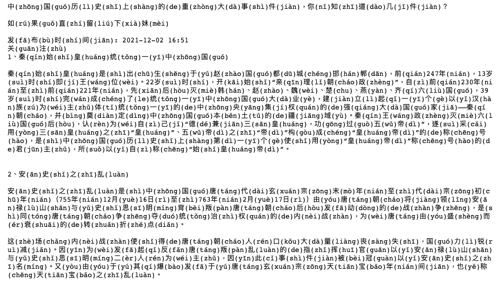
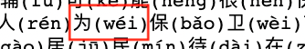
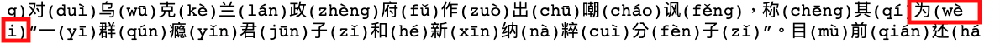
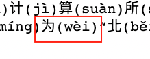
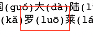
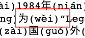
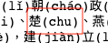
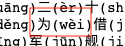

{
 "cells": [
  {
   "cell_type": "markdown",
   "id": "d7b3cbfd",
   "metadata": {},
   "source": [
    "# Chinese Pinyin Mapping Function\n",
    "_______________\n",
    "## Contents\n",
    "1. **Introduction**\n",
    "2. **My Approach**\n",
    "3. **Findings**\n",
    "4. **Ideas for Further Research**\n",
    "5. **Recommendations**"
   ]
  },
  {
   "cell_type": "markdown",
   "id": "6767230d",
   "metadata": {},
   "source": [
    "## 1. Introduction\n",
    "____\n",
    "The Chinese language is written using symbols called characters to represent meaning. Unlike words in a phonetic alphabet, there is no indication of how to pronounce each character. Therefore, to help people learn Chinese, a phonetic alphabet based on the latin alphabet was invented called pinyin. In different contexts, the same character can have different pronunciations, with some characters having as many as seven different pronunciations.\n",
    "\n",
    "In textbooks, when a new character is presented, the pinyin is usually also given so that the reader learns how to pronounce the character. Chinese texts in the wild typically only contain characters. But for learners of the language, it is sometimes helpful to give the pronunciation of each character in a text. It is for this reason that I created a function that maps each character to it’s correct pronunciation given the context. "
   ]
  },
  {
   "attachments": {},
   "cell_type": "markdown",
   "id": "ecad8aeb",
   "metadata": {},
   "source": [
    "## 2. My Approach\n",
    "____\n",
    "The first step in the process of building the pinyin mapping function was to generate a list of all the Chinese characters with all of their pronunciations and their frequencies. This required some parsing and pruning of a list of each character with its given pronunciation found at the [Unihan Database](https://www.unicode.org/charts/unihan.html). Unihan are Unicode for Chinese characters.\n",
    "\n",
    "Some characters were missing frequency information so for these characters, I gave them a frequency of 1. Most of the characters that had multiple pronunciations had frequencies for them.\n",
    "\n",
    "The second step was to build a mapping function that mapped single characters to their pronunciation based on the most frequent pronunciation of a given character. This approach would lead to correct mappings most of the time, but there are still some cases where the mapping would be wrong based on context. For this reason a more sophisticated mapping function was needed.\n",
    "\n",
    "The final step in building a function that outputs the correct pinyin of each character was to use a phrase dictionary which contained the correct pronunciation of 96,809 words and phrases. I should note here that most Chinese words are made up of two to three characters. The majority of words and phrases in this list were two-letter words.\n",
    "\n",
    "For the second function, I first looked at each set of two consecutive characters in the text and compared them to all of the words in the phrase dictionary to see if there was a match (ie. if these two characters were a word with a set pronunciation). If there was a match, the function output that pronunciation, if there was no match, then the pronunciation from the pinyin frequency dictionary was used. Then the function moves on to the next character in the text to repeat the process."
   ]
  },
  {
   "cell_type": "markdown",
   "id": "59b75dc7",
   "metadata": {},
   "source": [
    "### Sample input and output\n",
    "___"
   ]
  },
  {
   "cell_type": "markdown",
   "id": "46ce2600",
   "metadata": {},
   "source": [
    "\n",
    "\n",
    ""
   ]
  },
  {
   "cell_type": "markdown",
   "id": "a3c1f26e",
   "metadata": {},
   "source": [
    "## 3. Findings\n",
    "___\n",
    "\n",
    "In order to evaluate how my pinyin mapping function worked, I passed it three texts and checked them to see if there were any mispronunciations. Below are some of the pronunciations that were incorrect.\n",
    "\n",
    "**Article 1: New York Times Chinese Edition - [Ukraine](https://cn.nytimes.com/world/20220226/ukraine-russia-war-kyiv/)**\n",
    "\n",
    "Errors:\n",
    "\n",
    "\n",
    "Should be fourth tone: wèi\n",
    "\n",
    "\n",
    "Should be second tone: wéi\n",
    "\n",
    "Total errors: 2\n",
    "\n",
    "**Article 2: Wikipedia - [Lenovo](https://zh.wikipedia.org/wiki/%E8%81%94%E6%83%B3%E9%9B%86%E5%9B%A2)**\n",
    "\n",
    "Errors:\n",
    "\n",
    "\n",
    "Should be second tone: wéi\n",
    "\n",
    "\n",
    "Should be second tone: lúo\n",
    "\n",
    "\n",
    "Should be second tone: wéi\n",
    "\n",
    "Total errors: 3\n",
    "\n",
    "**Article 3: Baidu - [Chinese History](https://baijiahao.baidu.com/s?id=1718023695121784419&wfr=spider&for=pc)**\n",
    "\n",
    "Errors:\n",
    "\n",
    "\n",
    "Should be third tone: chǔ\n",
    "\n",
    "\n",
    "Should be second tone: wéi\n",
    "\n",
    "Total errors: 2\n",
    "\n",
    "Besides these few pronunciations, all of the other pronunciations were correct."
   ]
  },
  {
   "cell_type": "markdown",
   "id": "1e0b90e4",
   "metadata": {},
   "source": [
    "## 4. Ideas for Further Research\n",
    "___\n",
    "\n",
    "In order to build a more precise pinyin mapping function, the function could be made to check three-letter and four-letter words and phrases first using the phrase dictionary, and then proceeding to check for two-letter words and then single-characters words like in the function I created.\n",
    "\n",
    "One could also present the pinyin and character of the output in a more attractive way. [This project](https://github.com/jeffreyxuan/toneoz-font-pinyin-kai) on Github presents some options for doing this.\n",
    "\n",
    "My function only deals with simplified Chinese characters, which are used primarily in mainland China. But other places like Taiwan and Hong Kong use traditional Chinese characters, so a function could be built that would take these other forms of characters into account. Not all characters have a simplified version, by some estimates, 30% of the 3,500 most common characters in use have been simplified.\n",
    "\n",
    "I could find a way to eliminate the incorrect pronunciations I found, especially wéi/wèi, which was responsible for over half of the errors I found.\n"
   ]
  },
  {
   "cell_type": "markdown",
   "id": "c14de0b8",
   "metadata": {},
   "source": [
    "## 5. Recommendations\n",
    "\n",
    "The pinyin creator can be used to give the correct pronunciations to any simplified Chinese text passed to it. Three ways I recommend using this tool are: \n",
    "* It can be used to study the language by giving readers the pronunciations of unknown characters.\n",
    "* It can be integrated into an app or dictionary.\n",
    "* It can be used to cross check other pinyin mapping texts, apps, and dictionaries.\n"
   ]
  }
 ],
 "metadata": {
  "kernelspec": {
   "display_name": "Python 3",
   "language": "python",
   "name": "python3"
  },
  "language_info": {
   "codemirror_mode": {
    "name": "ipython",
    "version": 3
   },
   "file_extension": ".py",
   "mimetype": "text/x-python",
   "name": "python",
   "nbconvert_exporter": "python",
   "pygments_lexer": "ipython3",
   "version": "3.8.8"
  }
 },
 "nbformat": 4,
 "nbformat_minor": 5
}
